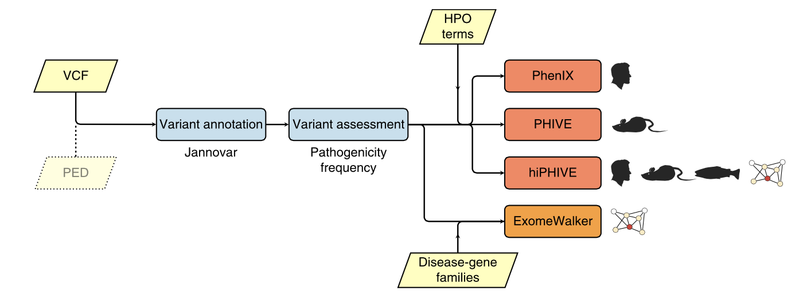
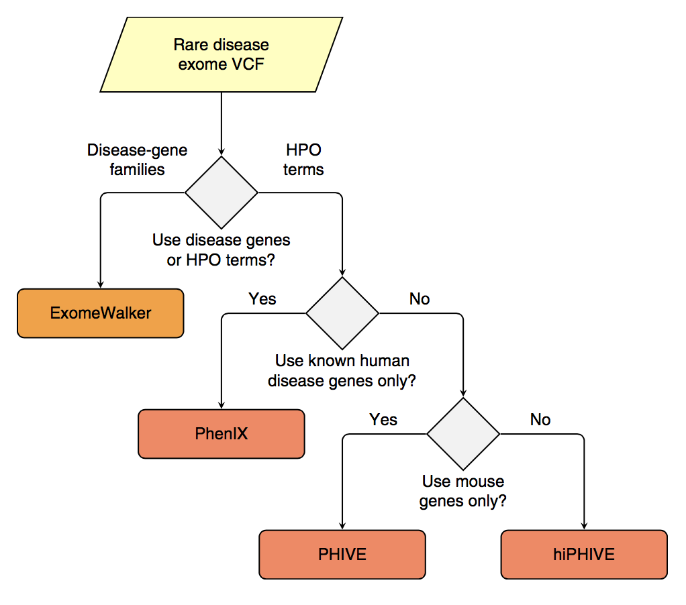

README
======

Exomiser is an application that prioritises genes and variants in next-generation sequencing (NGS) projects for novel disease-gene discovery or differential diagnostics of Mendelian disease. Exomiser comprises a suite of algorithms for prioritising exome sequences using random-walk analysis of protein interaction networks, clinical relevance and cross-species phenotype comparisons, as well as a wide range of other computational filters for variant frequency, predicted pathogenicity and pedigree analysis.

The Exomiser initially annotates variants using Jannovar, and then it removes variants that are off the exomic target or that are more common than a user-supplied threshold; it then ranks the remaining variants according to their predicted pathogenicity. Finally, the clinical relevance of the genes harbouring these variants is assessed using one of three phenotype-driven algorithms (PHIVE, PhenIX or hiPHIVE) or by a random-walk algorithm that assesses the vicinity of the genes to members of disease-gene family on the protein-protein interactome.

* If your VCF file is a multisample exome file containing data from affected and unaffected related people, then these relationships should be specified in a pedigree file.
* If the specific phenotypes exhibited by the patient are not to hand, but the suspected or diagnosed disease is, then this can be specified by replacing the `--hpo-ids <arg>` option with `--disease-id <arg>` or `-D <arg>` where `<arg>` is an OMIM, Orphanet or DECIPHER disease identifier

# Prioritisation

The Exomiser suite contains a number of different methods for variant prioritization based on protein-protein interactions and/or phenotype comparisons between a patient and existing human disease databases and model organisms. Exomiser calculates variant-based and method-specific, gene-based scores and combines them using a logistical regression model to generate a final combined score that is used for ranking. The variant scores are a combination of how rare the variant is as observed in the 1000 Genomes Project and Exome Server Project data sets, together with its predicted pathogenicity.

# Converting to HPO terms

The HPO can be explored in a number of other websites including the Ontology Lookup Service of the European Bioinformatics Institute (EBI) and the BioPortal of the National Center for Bio-Ontologies. Terms can also be entered in the clinic using PhenoTips and exported.

# Limitations

The Exomiser is designed only for the analysis of Mendelian disease, i.e., it searches for single genes with predicted pathogenic mutations that can best explain the clinical symptoms.

# Analysis

~~~~{.bash}
cd exomiser-cli-7.2.1

# hiPHIVE
cat ../hiphive.settings
vcf=data/Pfeiffer.vcf
prioritiser=hiphive
max-freq=1.0
hpo-ids=HP:0001156, HP:0001363, HP:0011304, HP:0010055
out-prefix=../results/pfeiffer_hiphive
out-format=TSV-GENE,TSV-VARIANT,VCF,HTML

java -jar exomiser-cli-7.2.1.jar --settings-file ../hiphive.settings

# hiPHIVE with OMIM
cat hiphive_omim.settings 
vcf=data/Pfeiffer.vcf
prioritiser=hiphive
max-freq=1.0
disease-id=101600
out-prefix=../results/pfeiffer_hiphive_omim
out-format=TSV-GENE,TSV-VARIANT,VCF,HTML

java -jar exomiser-cli-7.2.1.jar --settings-file ../hiphive_omim.settings

# PhenIX
cat ../phenix.settings 
vcf=data/Pfeiffer.vcf
prioritiser=phenix
max-freq=1.0
hpo-ids=HP:0001156, HP:0001363, HP:0011304, HP:0010055
out-prefix=../results/pfeiffer_phenix
out-format=TSV-GENE,TSV-VARIANT,VCF,HTML

java -jar exomiser-cli-7.2.1.jar --settings-file ../phenix.settings

# ExomeWalker
cat ../exomewalker.settings 
vcf=data/Pfeiffer.vcf
prioritiser=exomewalker
seed-genes=2260,2246,2253
max-freq=1.0
out-prefix=../results/pfeiffer_exomewalker
out-format=TSV-GENE,TSV-VARIANT,VCF,HTML

java -jar exomiser-cli-7.2.1.jar --settings-file ../exomewalker.settings

cd ../results
bgzip pfeiffer_exomewalker.vcf
bgzip pfeiffer_hiphive.vcf
bgzip pfeiffer_phenix.vcf
bgzip pfeiffer_hiphive_omim.vcf
gzip *.tsv
~~~~

# Results

~~~~{.bash}
gunzip -c pfeiffer_hiphive.genes.tsv.gz | cut -f1-6 | head
#GENE_SYMBOL    ENTREZ_GENE_ID  EXOMISER_GENE_PHENO_SCORE       EXOMISER_GENE_VARIANT_SCORE     EXOMISER_GENE_COMBINED_SCORE    HUMAN_PHENO_SCORE
FGFR2   2263    0.8763  1.0000  0.9933  0.8763
FAT4    79633   0.7040  0.8489  0.8613  0.7040
MND1    84057   0.5084  1.0000  0.7651  0.0000
HNF1A   6927    0.5072  1.0000  0.7628  0.0000
AXIN1   8312    0.5067  1.0000  0.7618  0.0000
DNASE1L2        1775    0.7037  0.7763  0.7606  0.0000
COG7    91949   0.5012  1.0000  0.7514  0.0000
SPAG9   9043    0.5007  1.0000  0.7503  0.0000
MAPKBP1 23005   0.5446  0.9500  0.7497  0.0000

gunzip -c pfeiffer_hiphive_omim.genes.tsv.gz | head
#GENE_SYMBOL    ENTREZ_GENE_ID  EXOMISER_GENE_PHENO_SCORE       EXOMISER_GENE_VARIANT_SCORE     EXOMISER_GENE_COMBINED_SCORE    HUMAN_PHENO_SCORE       MOUSE_PHENO_SCORE       FISH_PHENO_SCORE        WALKER_SCORE    PHIVE_ALL_SPECIES_SCORE OMIM_SCORE      MATCHES_CANDIDATE_GENE  HUMAN_PHENO_EVIDENCE    MOUSE_PHENO_EVIDENCE    FISH_PHENO_EVIDENCE     HUMAN_PPI_EVIDENCE      MOUSE_PPI_EVIDENCE      FISH_PPI_EVIDENCE
AXIN1   8312    0.0000  1.0000  0.0162  0.0000  0.0000  0.0000  0.0000  0.0000  1.0000  0
COG7    91949   0.0000  1.0000  0.0162  0.0000  0.0000  0.0000  0.0000  0.0000  1.0000  0
FGFR2   2263    0.0000  1.0000  0.0162  0.0000  0.0000  0.0000  0.0000  0.0000  1.0000  0
FRMPD1  22844   0.0000  1.0000  0.0162  0.0000  0.0000  0.0000  0.0000  0.0000  1.0000  0
HNF1A   6927    0.0000  1.0000  0.0162  0.0000  0.0000  0.0000  0.0000  0.0000  1.0000  0
MND1    84057   0.0000  1.0000  0.0162  0.0000  0.0000  0.0000  0.0000  0.0000  1.0000  0
OR7D2   162998  0.0000  1.0000  0.0162  0.0000  0.0000  0.0000  0.0000  0.0000  1.0000  0
PTPRD   5789    0.0000  1.0000  0.0162  0.0000  0.0000  0.0000  0.0000  0.0000  1.0000  0
RBP5    83758   0.0000  1.0000  0.0162  0.0000  0.0000  0.0000  0.0000  0.0000  1.0000  0

gunzip -c pfeiffer_phenix.genes.tsv.gz | head
#GENE_SYMBOL    ENTREZ_GENE_ID  EXOMISER_GENE_PHENO_SCORE       EXOMISER_GENE_VARIANT_SCORE     EXOMISER_GENE_COMBINED_SCORE    HUMAN_PHENO_SCORE       MOUSE_PHENO_SCORE       FISH_PHENO_SCORE        WALKER_SCORE    PHIVE_ALL_SPECIES_SCORE OMIM_SCORE      MATCHES_CANDIDATE_GENE  HUMAN_PHENO_EVIDENCE    MOUSE_PHENO_EVIDENCE    FISH_PHENO_EVIDENCE     HUMAN_PPI_EVIDENCE      MOUSE_PPI_EVIDENCE      FISH_PPI_EVIDENCE
FGFR2   2263    1.0000  1.0000  0.9979  0.0000  0.0000  0.0000  0.0000  0.0000  1.0000  0
ROR2    4920    0.4709  0.7894  0.1536  0.0000  0.0000  0.0000  0.0000  0.0000  0.5000  0
TNXB    7148    0.4412  0.8604  0.1409  0.0000  0.0000  0.0000  0.0000  0.0000  1.0000  0
SH3PXD2B        285590  0.3930  0.7487  0.0521  0.0000  0.0000  0.0000  0.0000  0.0000  1.0000  0
COL4A1  1282    0.3064  0.8615  0.0269  0.0000  0.0000  0.0000  0.0000  0.0000  1.0000  0
RAI1    10743   0.2862  0.8500  0.0198  0.0000  0.0000  0.0000  0.0000  0.0000  0.5000  0
FREM2   341640  0.2783  0.8489  0.0178  0.0000  0.0000  0.0000  0.0000  0.0000  0.5000  0
TRHR    7201    0.2864  0.8081  0.0168  0.0000  0.0000  0.0000  0.0000  0.0000  1.0000  0
KANSL1  284058  0.2645  0.7654  0.0106  0.0000  0.0000  0.0000  0.0000  0.0000  0.5000  0

gunzip -c pfeiffer_exomewalker.genes.tsv.gz | head
#GENE_SYMBOL    ENTREZ_GENE_ID  EXOMISER_GENE_PHENO_SCORE       EXOMISER_GENE_VARIANT_SCORE     EXOMISER_GENE_COMBINED_SCORE    HUMAN_PHENO_SCORE       MOUSE_PHENO_SCORE       FISH_PHENO_SCORE        WALKER_SCORE    PHIVE_ALL_SPECIES_SCORE OMIM_SCORE      MATCHES_CANDIDATE_GENE  HUMAN_PHENO_EVIDENCE    MOUSE_PHENO_EVIDENCE    FISH_PHENO_EVIDENCE     HUMAN_PPI_EVIDENCE      MOUSE_PPI_EVIDENCE      FISH_PPI_EVIDENCE
FGFR2   2263    0.0210  1.0000  0.9887  0.0000  0.0000  0.0000  0.0210  0.0000  1.0000  0
AXIN1   8312    0.0001  1.0000  0.4719  0.0000  0.0000  0.0000  0.0001  0.0000  1.0000  0
SPAG9   9043    0.0001  1.0000  0.4710  0.0000  0.0000  0.0000  0.0001  0.0000  1.0000  0
HNF1A   6927    0.0000  1.0000  0.4676  0.0000  0.0000  0.0000  0.0000  0.0000  1.0000  0
PTPRD   5789    0.0000  1.0000  0.4663  0.0000  0.0000  0.0000  0.0000  0.0000  1.0000  0
TAX1BP1 8887    0.0000  1.0000  0.4663  0.0000  0.0000  0.0000  0.0000  0.0000  1.0000  0
MND1    84057   0.0000  1.0000  0.4662  0.0000  0.0000  0.0000  0.0000  0.0000  1.0000  0
TNRC6A  27327   0.0000  1.0000  0.4661  0.0000  0.0000  0.0000  0.0000  0.0000  1.0000  0
COG7    91949   0.0000  1.0000  0.4661  0.0000  0.0000  0.0000  0.0000  0.0000  1.0000  0
~~~~~

# References

* [Next-generation diagnostics and disease-gene discovery with the Exomiser](https://www.ncbi.nlm.nih.gov/pubmed/26562621)

