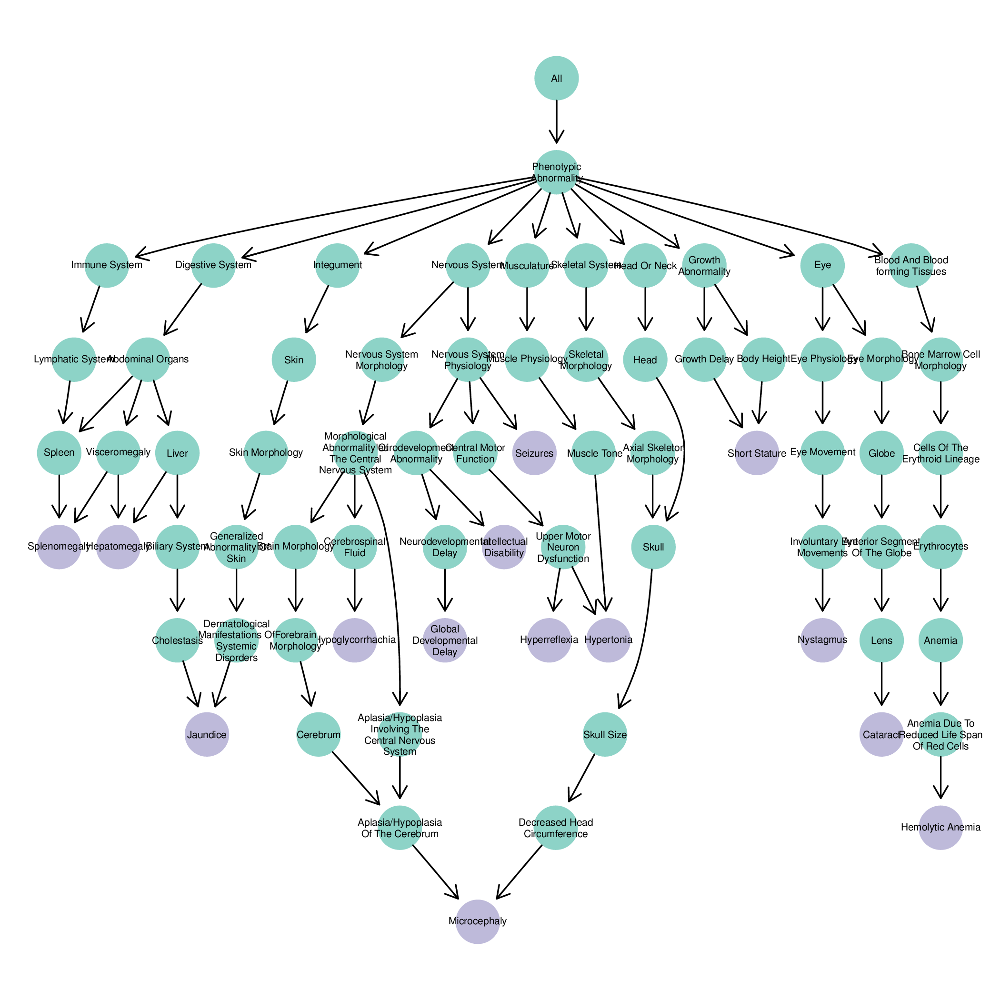
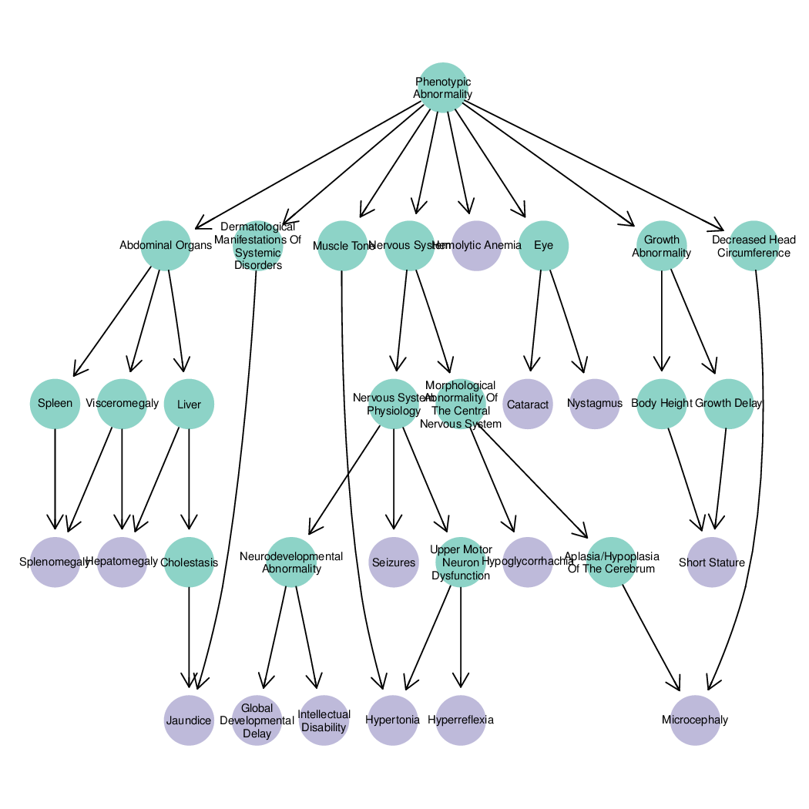

## Genes to phenotype and vice versa

The HPO team have provided two files that associate genes to HPO phenotypes and HPO phenotypes to genes.

```bash
# 925K
gunzip -c ../data/ALL_SOURCES_ALL_FREQUENCIES_genes_to_phenotype.txt.gz | head -5
#Format: entrez-gene-id<tab>entrez-gene-symbol<tab>HPO-Term-Name<tab>HPO-Term-ID
8192    CLPP    Seizures        HP:0001250
8192    CLPP    Short stature   HP:0004322
8192    CLPP    Primary amenorrhea      HP:0000786
8192    CLPP    Autosomal recessive inheritance HP:0000007

# 2.6M
gunzip -c ../data/ALL_SOURCES_ALL_FREQUENCIES_phenotype_to_genes.txt.gz | head -5
#Format: HPO-ID<tab>HPO-Name<tab>Gene-ID<tab>Gene-Name
HP:0001459      1-3 toe syndactyly      2737    GLI3
HP:0006088      1-5 finger complete cutaneous syndactyly        64327   LMBR1
HP:0010708      1-5 finger syndactyly   6469    SHH
HP:0010708      1-5 finger syndactyly   64327   LMBR1
```

The files are [not symmetrical](http://human-phenotype-ontology.github.io/faq.html) because the genes to phenotype file only lists the HPO term on the bottom of the ontology tree, i.e. and not all the ancestors.

```bash
gunzip -c ../data/ALL_SOURCES_ALL_FREQUENCIES_genes_to_phenotype.txt.gz | grep HP:0001459
2737    GLI3    1-3 toe syndactyly      HP:0001459

gunzip -c ../data/ALL_SOURCES_ALL_FREQUENCIES_phenotype_to_genes.txt.gz | grep HP:0001459
HP:0001459      1-3 toe syndactyly      2737    GLI3

# find the most frequent HPO terms
gunzip -c ../data/ALL_SOURCES_ALL_FREQUENCIES_genes_to_phenotype.txt.gz | cut -f4 | sort | uniq -c | sort -k1rn | head -5
1935 HP:0000007
1233 HP:0000006
 948 HP:0001249
 914 HP:0001250
 869 HP:0001263

gunzip -c ../data/ALL_SOURCES_ALL_FREQUENCIES_phenotype_to_genes.txt.gz | cut -f1 | sort | uniq -c | sort -k1rn | head -5
2422 HP:0000707
2217 HP:0012638
1957 HP:0000152
1935 HP:0000007
1934 HP:0000234

gunzip -c ../data/ALL_SOURCES_ALL_FREQUENCIES_genes_to_phenotype.txt.gz | grep HP:0000707 | wc -l
13

gunzip -c ../data/ALL_SOURCES_ALL_FREQUENCIES_phenotype_to_genes.txt.gz | grep HP:0000707 | wc -l
2422
```

How many genes are associated to phenotypes?

```bash
gunzip -c ../data/ALL_SOURCES_ALL_FREQUENCIES_phenotype_to_genes.txt.gz | grep -v "^#" | cut -f4 | sort -u | wc -l
3407

gunzip -c ../data/ALL_SOURCES_ALL_FREQUENCIES_genes_to_phenotype.txt.gz | grep -v "^#" | cut -f1 | sort -u | wc -l
3407
```

How many phenotypes are associated to genes on average?

```bash
# most genes associated to around 20 phenotypes
gunzip -c ../data/ALL_SOURCES_ALL_FREQUENCIES_genes_to_phenotype.txt.gz |
grep -v "^#" | cut -f1 | sort | uniq -c | awk '{print $1}' | stats
Total lines:            3407
Sum of lines:           105430
Ari. Mean:              30.9451130026416
Geo. Mean:              18.2808871643957
Median:                 20
Mode:                   2 (N=150)
Anti-Mode:              86 (N=1)
Minimum:                1
Maximum:                378
Variance:               1083.70787676299
StdDev:                 32.9197186616622

gunzip -c ../data/ALL_SOURCES_ALL_FREQUENCIES_genes_to_phenotype.txt.gz |
grep -v "^#" | cut -f2 | sort | uniq -c | sort -k1rn | head
    378 LMNA
    292 FGFR2
    267 FLNA
    265 FGFR3
    249 PTEN
    239 COL2A1
    226 ELN
    222 FGFR1
    207 CHD7
    202 BRAF
```

## Genes to OMIM

The `gene_to_omim.pl` script can look up OMIM disorders from a gene symbol.

```bash
gene_to_omim.pl FGFR2
FGFR2   614592
FGFR2   613659
FGFR2   609579
FGFR2   207410
FGFR2   149730
FGFR2   123790
FGFR2   123500
FGFR2   123150
FGFR2   101600
FGFR2   101400
FGFR2   101200
There were 11 matches for FGFR2
```

## Example usage

I'm interested in the HPO terms associated with the gene [SLC2A1](https://ghr.nlm.nih.gov/gene/SLC2A1), which encodes GLUT1. The GLUT1 protein helps transport glucose into cells from blood.

```bash
gene_to_omim.pl SLC2A1
SLC2A1  608885
There were 1 matches for SLC2A1
```

SLC2A1 is associated with [STOMATIN-DEFICIENT CRYOHYDROCYTOSIS WITH NEUROLOGIC DEFECTS](https://www.omim.org/entry/608885).

```bash
gene_to_hpo.pl SLC2A1
6513    SLC2A1  Hepatomegaly    HP:0002240
6513    SLC2A1  Intellectual disability HP:0001249
6513    SLC2A1  Seizures        HP:0001250
6513    SLC2A1  Short stature   HP:0004322
6513    SLC2A1  Hyperreflexia   HP:0001347
6513    SLC2A1  Hypoglycorrhachia       HP:0011972
6513    SLC2A1  Cataract        HP:0000518
6513    SLC2A1  Global developmental delay      HP:0001263
6513    SLC2A1  Splenomegaly    HP:0001744
6513    SLC2A1  Hemolytic anemia        HP:0001878
6513    SLC2A1  Jaundice        HP:0000952
6513    SLC2A1  Microcephaly    HP:0000252
6513    SLC2A1  Hypertonia      HP:0001276
6513    SLC2A1  Nystagmus       HP:0000639
There were 14 matches for SLC2A1
```

Visualise the HPO terms.

```bash
../prop/plot_hpo.R HP:0002240 HP:0001249 HP:0001250 HP:0004322 HP:0001347 HP:0011972 HP:0000518 HP:0001263 HP:0001744 HP:0001878 HP:0000952 HP:0000252 HP:0001276 HP:0000639
convert -density 300 -quality 100 hpo.pdf hpo.png
mv hpo-0.png image/SLC2A1_full.png
mv hpo-1.png image/SLC2A1_condensed.png
rm hpo.pdf
```




