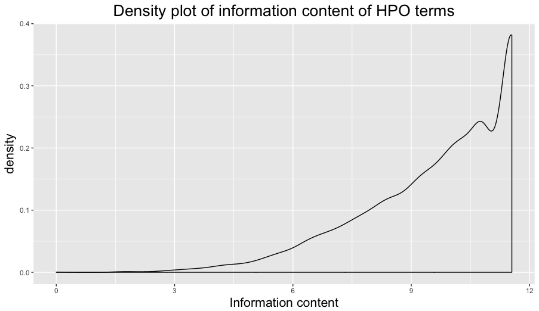

Properties of HPO terms
-----------------------

# HPO terms

How many HPO terms?

~~~~{.bash}
gunzip -c ../script/hp.obo.gz |
grep "^id" |
sed 's/id: //' |
sort -u |
wc -l
11785
~~~~

How many are associated with OMIM disorders?

~~~~{.bash}
gunzip -c ../script/phenotype_annotation.tab.gz |
grep "^OMIM" |
cut -f5 |
sort -u |
wc -l
    6873

~~~~

# Co-occurrence

How often do HP:0000648 (optic atrophy) and HP:0000668 (hypodontia) co-occur in the same OMIM disorder?

~~~~{.bash}
gunzip -c ../script/phenotype_annotation.tab.gz |
grep "^OMIM" |
cut -f2 |
sort -u |
wc -l
6947

gunzip -c ../script/phenotype_annotation.tab.gz |
grep "^OMIM" |
cut -f2,5 |
grep "HP:0000648\|HP:0000668" |
sort -u |
cut -f1 |
sort |
uniq -c |
sort -k1rn |
head
      2 101800
      2 194190
      2 272440
      2 303600
      2 305600
      2 308300
      2 607694
      1 101200
      1 101400
      1 103285

~/script/omim_to_gene.R 101800
[1] "ACRODYSOSTOSIS 1 WITH OR WITHOUT HORMONE RESISTANCE; ACRDYS1"
[1] "PRKAR1A, TSE1, CNC1, CAR, PPNAD1, ACRDYS1"

~/script/omim_to_gene.R 101800
[1] "ACRODYSOSTOSIS 1 WITH OR WITHOUT HORMONE RESISTANCE; ACRDYS1"
[1] "PRKAR1A, TSE1, CNC1, CAR, PPNAD1, ACRDYS1"

~/script/omim_to_gene.R 194190
[1] "WOLF-HIRSCHHORN SYNDROME; WHS"
NULL

~/script/omim_to_gene.R 272440
[1] "FILIPPI SYNDROME; FLPIS"
[1] "CKAP2L, RADMIS"

~/script/omim_to_gene.R 303600
[1] "COFFIN-LOWRY SYNDROME; CLS"
[1] "RPS6KA3, RSK2, MRX19"

~/script/omim_to_gene.R 305600
[1] "FOCAL DERMAL HYPOPLASIA; FDH"
[1] "PORCN, PORC, DHOF, FODH"

~/script/omim_to_gene.R 308300
[1] "INCONTINENTIA PIGMENTI; IP"
[1] "IKBKG, NEMO, FIP3, IP, IPD2, AMCBX1, IMD33"

~/script/omim_to_gene.R 607694
[1] "LEUKODYSTROPHY, HYPOMYELINATING, 7, WITH OR WITHOUT OLIGODONTIA AND/OR HYPOGONADOTROPIC HYPOGONADISM; HLD7"
[1] "POLR3A, RPC1, RPC155, ADDH, HLD7"
~~~~

As a Perl script.

~~~~{.bash}
co.pl HP:0000648 HP:0000668 
308300
194190
607694
305600
303600
272440
101800
~~~~

# How many pairwise comparisons?

~~~~{.bash}
R --quiet -e 'choose(11785, 2)'
> choose(11785, 2)
[1] 69437220

time co_all.pl > cooccurrence.tsv

real    732m35.246s
user    731m49.280s
sys     0m0.404s

gzip cooccurrence.tsv

# around 12 hours
bc -l<<<732/60
12.20000000000000000000
~~~~

# Co-occurrence take two

Using `cooccurrence.tsv.gz`.

~~~~{.bash}
co_2.pl HP:0000648 HP:0000668
HP:0000648      HP:0000668      101800
HP:0000648      HP:0000668      194190
HP:0000648      HP:0000668      272440
HP:0000648      HP:0000668      303600
HP:0000648      HP:0000668      305600
HP:0000648      HP:0000668      308300
HP:0000648      HP:0000668      607694
~~~~

Most co-occurred terms.

~~~~{.bash}
gunzip -c cooccurrence.tsv.gz | wc -l
1516932

time gunzip -c cooccurrence.tsv.gz | sort -k1 -k2 | cut -f1,2 | uniq -c | sort -k1rn | head
    473 HP:0000007      HP:0001249
    468 HP:0000007      HP:0001250
    415 HP:0000007      HP:0004322
    395 HP:0000007      HP:0001252
    387 HP:0000007      HP:0001263
    369 HP:0001249      HP:0001250
    365 HP:0001250      HP:0001263
    358 HP:0000007      HP:0000252
    337 HP:0001250      HP:0001252
    319 HP:0001249      HP:0100543

real    0m36.480s
user    0m37.911s
sys     0m0.365s

gunzip -c cooccurrence.tsv.gz | sort -k1 -k2 | cut -f1,2 | uniq -c | sort -k1rn | gzip > cooccurrence.freq.gz

gunzip -c cooccurrence.freq.gz | wc -l
653304
~~~~

What are HP:0000007, HP:0000252, HP:0001249, HP:0001250, HP:0001252, HP:0001263, HP:0004322, and HP:0100543?

~~~~{.bash}
../script/hpo_to_term.pl HP:0000007 HP:0000252 HP:0001249 HP:0001250 HP:0001252 HP:0001263 HP:0004322 HP:0100543
HP:0000007      level: 2        disease associations: 2771
        autosomal recessive inheritance
        autosomal recessive
        autosomal recessive form
        autosomal recessive predisposition
HP:0000252      level: 9        disease associations: 959
        microcephaly
        abnormally small cranium
        abnormally small head
        abnormally small skull
        decreased circumference of cranium
        decreased size of cranium
        decreased size of head
        decreased size of skull
        reduced head circumference
        small calvarium
        small cranium
        small head
        small head circumference
        small skull
HP:0001249      level: 5        disease associations: 971
        intellectual disability
        dull intelligence
        low intelligence
        mental deficiency
        mental retardation
        mental retardation, nonspecific
        mental-retardation
        nonprogressive intellectual disability
        nonprogressive mental retardation
        poor school performance
HP:0001250      level: 4        disease associations: 1295
        seizures
        epilepsy
        seizure
HP:0001252      level: 5        disease associations: 1014
        muscular hypotonia
        hypotonia
        muscle hypotonia
HP:0001263      level: 6        disease associations: 734
        global developmental delay
        cognitive delay
        delayed cognitive development
        delayed development
        delayed developmental milestones
        delayed intellectual development
        delayed milestones
        delayed psychomotor development
        developmental delay
        developmental delay in early childhood
        developmental delay, global
        developmental retardation
        lack of psychomotor development
        mental and motor retardation
        motor and developmental delay
        psychomotor delay
        psychomotor development deficiency
        psychomotor development failure
        psychomotor developmental delay
        psychomotor retardation
        retarded development
        retarded mental development
        retarded psychomotor development
HP:0004322      level: 4        disease associations: 1351
        short stature
        decreased body height
        height less than 3rd percentile
        short stature (below 3rd percentile)
        small stature
HP:0100543      level: 5        disease associations: 1040
        cognitive impairment
        abnormality of cognition
        cognitive abnormality
        cognitive defects
        cognitive deficits
        intellectual impairment
        mental impairment
~~~~

A lot of the OMIM disorders are autosomal recessive and cause microcephaly, intellectual disability, seizures, muscular hypotonia, global developmental delay, short stature, and cognitive impairment.

# Using the ontologyIndex

~~~~{.r}
install.packages('ontologyIndex')
library(ontologyIndex)

hpo <- get_ontology(file = "../script/hp.obo.gz")
class(hpo)
[1] "ontology_index"

check(hpo)
[1] TRUE

names(hpo)
[1] "id"        "name"      "parents"   "children"  "ancestors" "obsolete"

length(hpo$id)
[1] 11785

head(hpo$id)
  HP:0000001   HP:0000002   HP:0000003   HP:0000005   HP:0000006   HP:0000007 
"HP:0000001" "HP:0000002" "HP:0000003" "HP:0000005" "HP:0000006" "HP:0000007"

head(hpo$name)
                       HP:0000001                        HP:0000002 
                            "All"      "Abnormality of body height" 
                       HP:0000003                        HP:0000005 
   "Multicystic kidney dysplasia"             "Mode of inheritance" 
                       HP:0000006                        HP:0000007 
 "Autosomal dominant inheritance" "Autosomal recessive inheritance"

hpo$name['HP:0000648']
     HP:0000648 
"Optic atrophy"

head(hpo$parents)
$`HP:0000001`
character(0)

$`HP:0000002`
[1] "HP:0001507"

$`HP:0000003`
[1] "HP:0000107"

$`HP:0000005`
[1] "HP:0000001"

$`HP:0000006`
[1] "HP:0000005"

$`HP:0000007`
[1] "HP:0000005"

hpo$parents$`HP:0000648`
[1] "HP:0012795"
~~~~

Several useful functions in the ontologyIndex package. Get the descendants of a term.

~~~~{.r}
get_descendants(hpo, 'HP:0000648')
[1] "HP:0000648" "HP:0007958"

hpo$name[hpo$children$`HP:0000648`]
                                    HP:0007958 
"Optic atrophy from cranial nerve compression"
~~~~

Using my script.

~~~~{.bash}
../script/hpo_to_tree.pl HP:0000648
HP:0000648      optic atrophy
HP:0012795      abnormality of the optic disc
HP:0000587      abnormality of the optic nerve
HP:0001098      abnormality of the fundus
HP:0004329      abnormality of the posterior segment of the globe
HP:0012374      abnormality of the globe
HP:0012372      abnormal eye morphology
HP:0000478      abnormality of the eye
HP:0000118      phenotypic abnormality
HP:0000001      all
Level 9

../script/hpo_to_tree.pl HP:0007958
HP:0007958      optic atrophy from cranial nerve compression
HP:0000648      optic atrophy
HP:0012795      abnormality of the optic disc
HP:0000587      abnormality of the optic nerve
HP:0001098      abnormality of the fundus
HP:0004329      abnormality of the posterior segment of the globe
HP:0012374      abnormality of the globe
HP:0012372      abnormal eye morphology
HP:0000478      abnormality of the eye
HP:0000118      phenotypic abnormality
HP:0000001      all
Level 10
~~~~

An ontology term has all the properties of its parents. The `minimal_set()` function will return the deepest level.

~~~~{.r}
minimal_set(hpo, c('HP:0000648', 'HP:0007958'))
[1] "HP:0007958"

get_ancestors(hpo, 'HP:0000648')
 [1] "HP:0000001" "HP:0000118" "HP:0000478" "HP:0012372" "HP:0012374" "HP:0004329"
 [7] "HP:0001098" "HP:0000587" "HP:0012795" "HP:0000648"

hpo$ancestors$`HP:0000648` == get_ancestors(hpo, 'HP:0000648')
 [1] TRUE TRUE TRUE TRUE TRUE TRUE TRUE TRUE TRUE TRUE
~~~~

The get_term_descendancy_matrix() creates the logical descendancy matrix for set of terms. If the term on a row, is an ancestor to the term on a column, the value is TRUE.

~~~~{.r}
get_term_descendancy_matrix(hpo, c("HP:0001098", "HP:0000587", "HP:0012795", "HP:0000648"))
           HP:0001098 HP:0000587 HP:0012795 HP:0000648
HP:0001098      FALSE       TRUE       TRUE       TRUE
HP:0000587      FALSE      FALSE       TRUE       TRUE
HP:0012795      FALSE      FALSE      FALSE       TRUE
HP:0000648      FALSE      FALSE      FALSE      FALSE
~~~~

The `get_term_frequencies()` function, calculates the frequency of a HPO term, including its parents. If more than a term is given to the function, the frequency is normalised by the total number of input terms.

~~~~{.r}
get_term_frequencies(hpo, 'HP:0000648')
HP:0000001 HP:0000118 HP:0000478 HP:0000587 HP:0000648 HP:0001098 HP:0004329 HP:0012372 
         1          1          1          1          1          1          1          1 
HP:0012374 HP:0012795 
         1          1

get_term_frequencies(hpo, 'HP:0007958')
HP:0000001 HP:0000118 HP:0000478 HP:0000587 HP:0000648 HP:0000707 HP:0000759 HP:0001098 
         1          1          1          1          1          1          1          1 
HP:0001291 HP:0001293 HP:0004329 HP:0007958 HP:0012372 HP:0012374 HP:0012639 HP:0012795 
         1          1          1          1          1          1          1          1

get_term_frequencies(hpo, c('HP:0000648', 'HP:0007958'))
HP:0000001 HP:0000118 HP:0000478 HP:0000587 HP:0000648 HP:0000707 HP:0000759 HP:0001098 
       1.0        1.0        1.0        1.0        1.0        0.5        0.5        1.0 
HP:0001291 HP:0001293 HP:0004329 HP:0007958 HP:0012372 HP:0012374 HP:0012639 HP:0012795 
       0.5        0.5        1.0        0.5        1.0        1.0        0.5        1.0

# all terms
my_freq <- get_term_frequencies(hpo, hpo$id)
length(my_freq)
[1] 11785

summary(my_freq)
     Min.   1st Qu.    Median      Mean   3rd Qu.      Max. 
0.0000848 0.0000848 0.0000848 0.0009788 0.0002546 0.9905000

head(my_freq[order(my_freq, decreasing = TRUE)])
HP:0000001 HP:0000118 HP:0000924 HP:0011842 HP:0040064 HP:0040068 
 0.9904964  0.9828596  0.2991090  0.2777259  0.2286805  0.1916843

hpo$name[head(names(my_freq[order(my_freq, decreasing = TRUE)]))]
                          HP:0000001                           HP:0000118 
                               "All"             "Phenotypic abnormality" 
                          HP:0000924                           HP:0011842 
"Abnormality of the skeletal system" "Abnormality of skeletal morphology" 
                          HP:0040064                           HP:0040068 
              "Abnormality of limbs"           "Abnormality of limb bone"
~~~~

The `get_term_info_content()` function calculates the information content of each term in a set of phenotypes. Less frequent terms have a higher information content.

~~~~{.r}
get_term_info_content(hpo, c('HP:0000648', 'HP:0007958'))
HP:0000001 HP:0000118 HP:0000478 HP:0000587 HP:0000648 HP:0000707 HP:0000759 HP:0001098 
 0.0000000  0.0000000  0.0000000  0.0000000  0.0000000  0.6931472  0.6931472  0.0000000 
HP:0001291 HP:0001293 HP:0004329 HP:0007958 HP:0012372 HP:0012374 HP:0012639 HP:0012795 
 0.6931472  0.6931472  0.0000000  0.6931472  0.0000000  0.0000000  0.6931472  0.0000000

my_ic <- get_term_info_content(hpo, hpo$id)
head(my_ic)
 HP:0000001  HP:0000002  HP:0000003  HP:0000005  HP:0000006  HP:0000007 
0.009549054 5.819234754 9.374582815 6.078745949 7.428672666 9.374582815

get_term_property(hpo, property_name = 'ancestors', term = 'HP:0000648')
 [1] "HP:0000001" "HP:0000118" "HP:0000478" "HP:0012372" "HP:0012374" "HP:0004329"
 [7] "HP:0001098" "HP:0000587" "HP:0012795" "HP:0000648"
~~~~

# Disease HPO frequency

HPO frequency and information content of HPO terms associated with OMIM diseases.

~~~~{.bash}
gunzip -c  ../script/phenotype_annotation.tab.gz | grep "^OMIM" | cut -f5 | gzip > disease_hpo.txt.gz
~~~~

Using the ontologyIndex package.

~~~~{.r}
library(ontologyIndex)

hpo <- get_ontology(file = "../script/hp.obo.gz")
dis <- read.table('disease_hpo.txt.gz', header = FALSE, stringsAsFactors = FALSE)
dis <- dis$V1

length(dis)
[1] 103841

length(unique(dis))
[1] 6873

freq <- get_term_frequencies(hpo, dis)
ic <- get_term_info_content(hpo, dis)

information_content <- data.frame(id = names(ic), info = ic, freq = freq, row.names = NULL)
dim(information_content)
[1] 8098    3

length(unique(information_content$info))
[1] 574
length(unique(information_content$freq))
[1] 574
length(unique(information_content$id))
[1] 8098

library(dplyr)
# freq is n / length(dis)
information_content %>% arrange(freq) %>% head()
          id     info         freq
1 HP:0000753 11.55062 9.630108e-06
2 HP:0001443 11.55062 9.630108e-06
3 HP:0001459 11.55062 9.630108e-06
4 HP:0001726 11.55062 9.630108e-06
5 HP:0001862 11.55062 9.630108e-06
6 HP:0001980 11.55062 9.630108e-06

information_content %>% filter(info > 10) %>% select(info) %>% table()
 10.164321800972 10.4520038734237 10.8574689815319 11.5506161620919 
             444              579             1030             2097

library(ggplot2)
ggplot(data = information_content, aes(info)) +
  geom_density() +
  labs(title = 'Density plot of information content of HPO terms', x = 'Information content') +
  theme(plot.title = element_text(size = 20, hjust = 0.5), axis.title = element_text(size = 16))
~~~~

Check out some of the HPO terms with a high information content; score of 11.55062 seem to be associated with only 1 disease.

~~~~{.bash}
# HP:0003332 11.55062
../script/hpo_to_term.pl HP:0003332
HP:0003332      level: 8        disease associations: 1
        absent primary metaphyseal spongiosa

# HP:0003329 10.85747
../script/hpo_to_term.pl HP:0003329
HP:0003329      level: 6        disease associations: 2
        hair shafts flattened at irregular intervals and twisted through 180 degrees about their axes

# HP:0003333 10.45200
../script/hpo_to_term.pl HP:0003333
HP:0003333      level: 8        disease associations: 3
        increased serum beta-hexosaminidase

~~~~

The number diseases each HPO term is associated with.

~~~~{.bash}
gunzip -c ../script/phenotype_annotation.tab.gz |
grep "^OMIM" |
cut -f2,5 |
awk '{print $2,$1}' |
sort -k1 |
cut -f1 -d' '|
uniq -c |
sort -k1rn |
head
   2771 HP:0000007
   2675 HP:0000006
   1092 HP:0004322
   1080 HP:0001250
    936 HP:0001249
    832 HP:0001252
    802 HP:0000252
    733 HP:0001263
    682 HP:0100543
    642 HP:0000347

gunzip -c ../script/phenotype_annotation.tab.gz | grep "^OMIM" | cut -f2,5 | awk '{print $2,$1}' | sort -k1 | cut -f1 -d' '| uniq -c | sort -k1rn | awk '{print $1}' | stats
Total lines:            6873
Sum of lines:           103841
Ari. Mean:              15.1085406663757
Geo. Mean:              3.92226199165308
Median:                 3
Mode:                   1 (N=2204)
Anti-Mode:              82 (N=1)
Minimum:                1
Maximum:                2771
Variance:               4268.1293508894
StdDev:                 65.330921858561
~~~~

How many HPO terms associated with diseases?

~~~~{.bash}
gunzip -c ../script/phenotype_annotation.tab.gz | grep "^OMIM" | cut -f2,5 | sort -k1 | awk '{print $1}' | uniq -c | head
     42 100050
      1 100070
     42 100100
      3 100200
     37 100300
      2 100600
      2 100650
      1 100675
      6 100700
     58 100800

gunzip -c ../script/phenotype_annotation.tab.gz | grep "^OMIM" | cut -f2,5 | sort -k1 | awk '{print $1}' | uniq -c | awk '{print $1}' | stats
Total lines:            6947
Sum of lines:           103841
Ari. Mean:              14.9476032819922
Geo. Mean:              8.64515221919539
Median:                 9
Mode:                   2 (N=809)
Anti-Mode:              83 (N=1)
Minimum:                1
Maximum:                249
Variance:               313.762620929126
StdDev:                 17.7133458423056
~~~~

